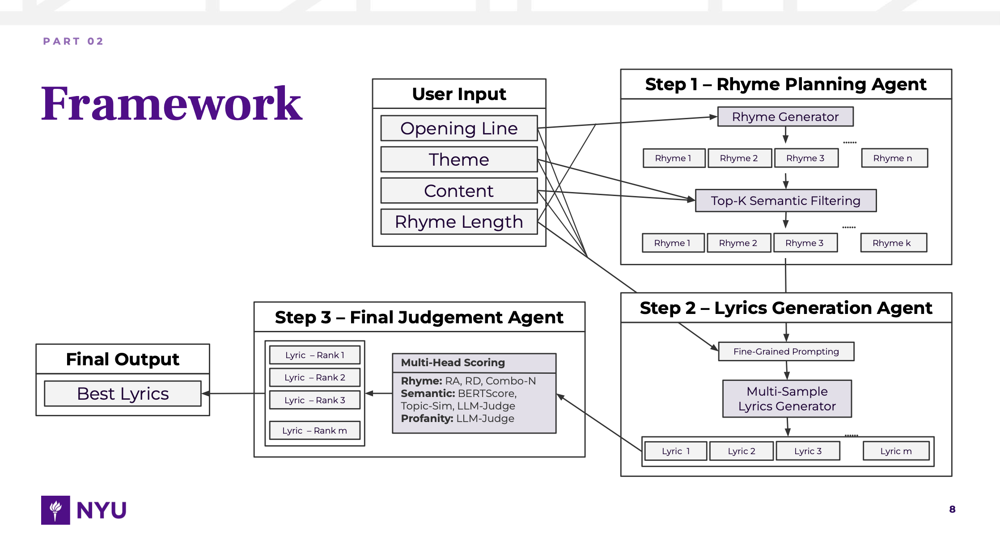
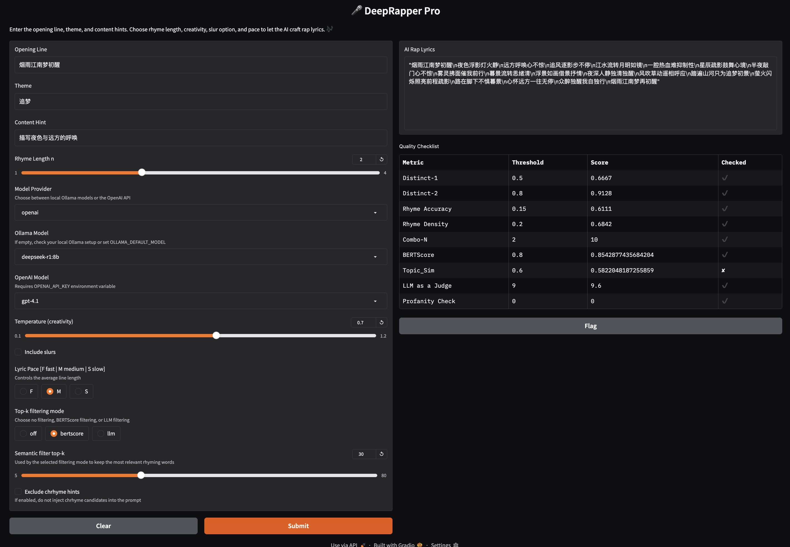

# DeepRapper Pro

DeepRapper Pro is a **controllable Chinese rap generation** pipeline that combines [*Chrhyme*](https://github.com/jiaeyan/chinese-rhymer) retrieval, semantic ranking, and multiple LLM providers inside a [*Gradio*](https://github.com/gradio-app/gradio) experience. The system can work fully locally with [*Ollama*](https://ollama.com/) or call OpenAI's Responses API, inject rhyme hints, optionally add slurs, and reports automatic quality checks for every verse.




## Requirements

- Python 3.10+ (for `typing` features used throughout the codebase).
- `chrhyme` CLI executable available on `PATH`. Install from its upstream instructions and ensure it can be invoked via `chrhyme` in the shell.
- Optional but recommended: GPU support for `sentence-transformers` models when using semantic filtering or evaluation scripts.
- Python dependencies (install in a virtual environment):

```bash
pip install -U gradio openai ollama jieba pypinyin sentence-transformers bert-score sacrebleu textstat torch transformers tqdm pandas numpy
```

> The evaluation scripts depend on heavy models (GPT-2, SimCSE, MiniLM). Download times can be significant on the first run.

## Running the Gradio App

```bash
python app.py
```

The UI exposes:

- Opening line, theme, and content hints.
- Rhyme length `n`, provider selection, and model dropdowns for Ollama/OpenAI.
- Creativity (`temperature`), optional slur toggle, and pace presets (`F/M/S`).
- Semantic filter mode (`off`, `bertscore`, `llm`) with configurable top-k.
- Option to exclude chrhyme hints entirely.

The output panel contains the generated lyrics and a metrics dataframe summarizing nine checks (Distinct-1/2, rhyme accuracy/density, Combo-N, BERTScore, topic similarity, LLM-as-a-judge, and profanity check).



## Programmatic Usage

```python
from main import generate_lyrics

result = generate_lyrics(
    first_line="烟雨江南梦初醒",
    theme="追梦",
    content="描写夜色与远方的呼唤",
    rhyme_len=2,
    provider="ollama",
    model_name="qwen2:7b",
    temperature=0.7,
    semantic_filter_mode="bertscore",
    semantic_top_k=30,
)

print(result["text"])
for row in result["metrics"]:
    print(row)
```

`generate_lyrics` always returns a dictionary with `text` (lyrics) and `metrics` (list of metric rows) even when the pipeline raises user-facing warnings.
